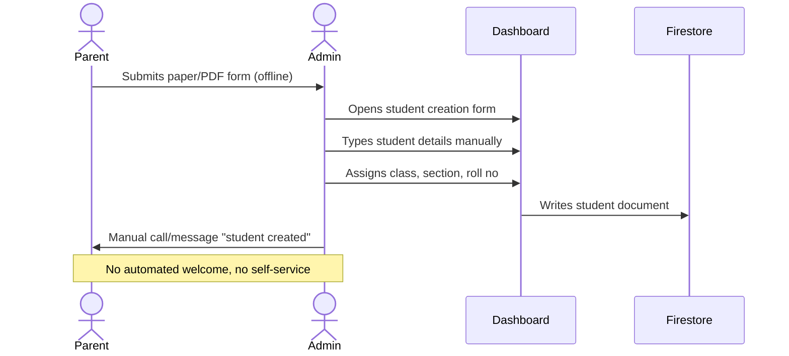
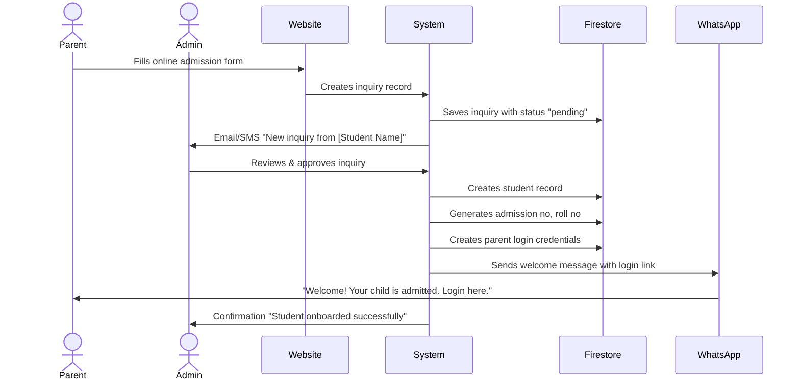
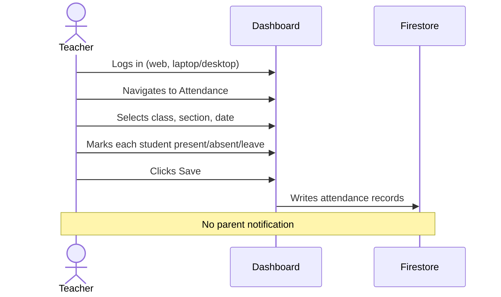
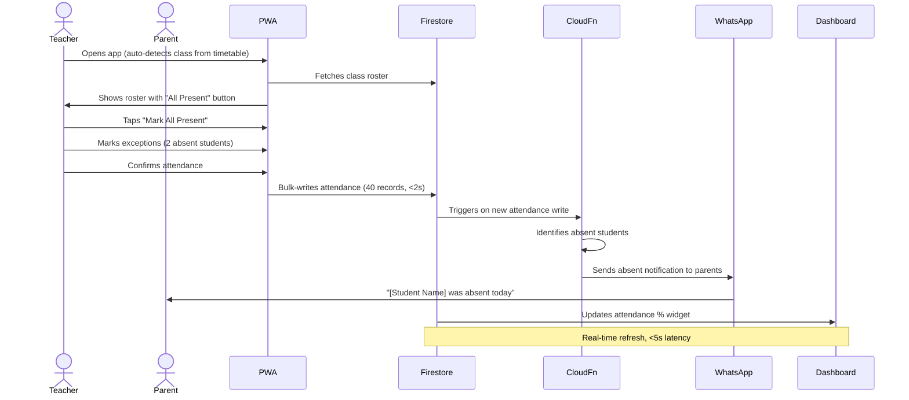
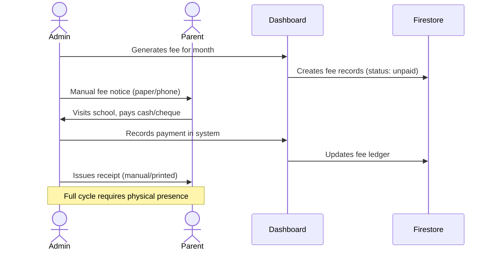
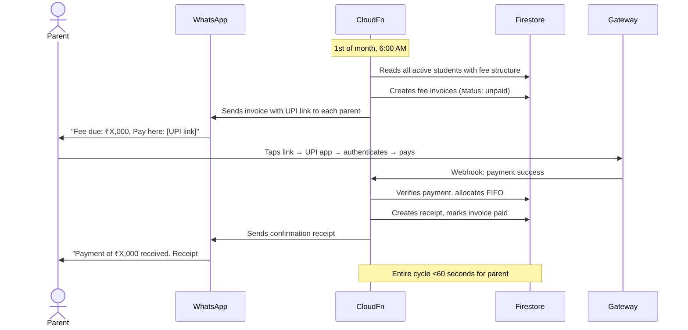
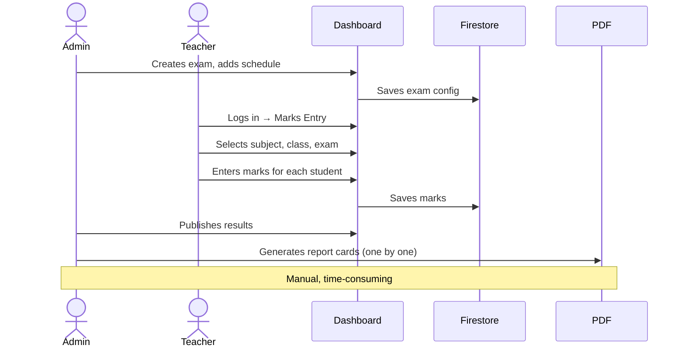
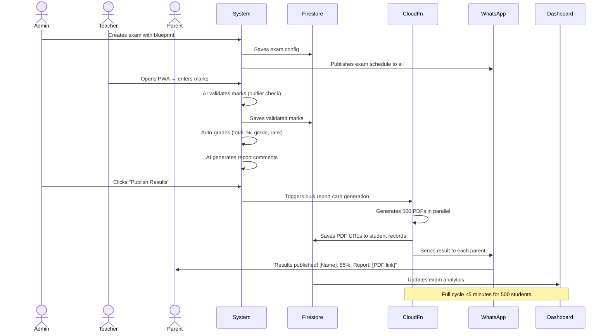
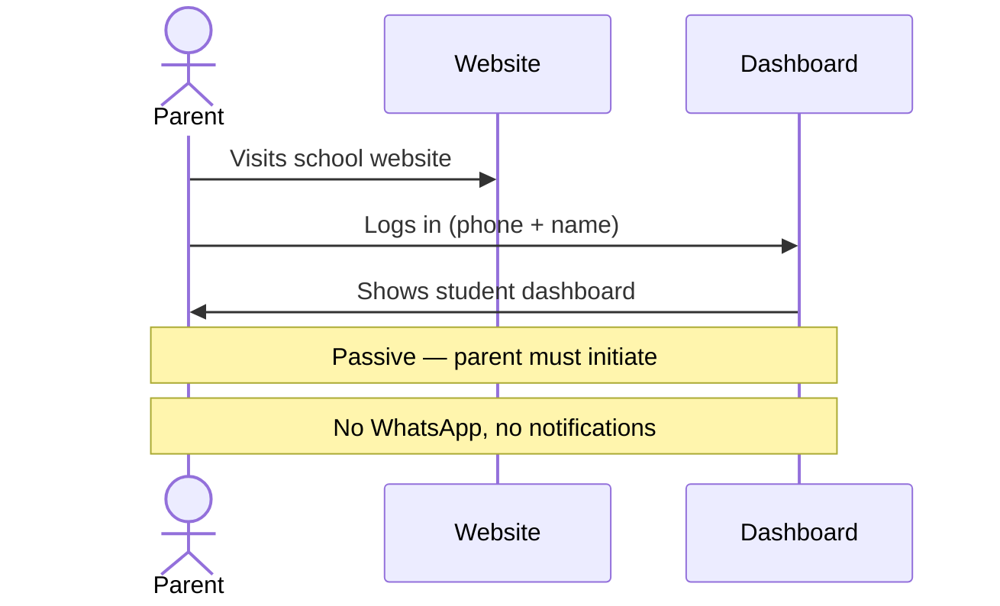
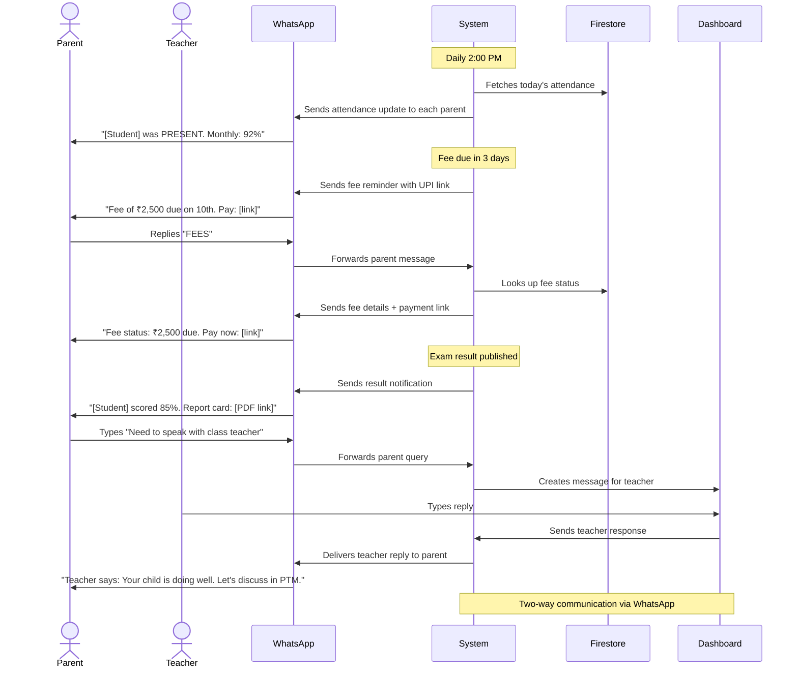

# Business Logic Flows — Current vs Ideal

This document compares 5 critical business logic flows as they currently work in SNR vs how they should work in a perfect school management system. Each flow includes a Mermaid sequence diagram of both current and ideal states.

---

## Flow 1: Student Onboarding

### Current SNR Flow

The current onboarding process is admin-driven and manual:

1. Parent fills a paper/PDF form (offline) or sends details via phone
2. Admin manually enters student details into the SNR dashboard
3. Admin creates a student record, assigns an admission number
4. Student record is written to Firestore
5. No automated communication to parent
6. Student appears in class roster after admin manually assigns to section

**Problems:**
- Parent has no self-service option
- Admin spends 5-10 minutes per student on data entry
- No automated admission number or roll number generation
- No welcome communication to parent
- Manual errors in spelling, dates, document numbers

### Ideal Flow

The ideal process is parent self-service with admin approval:

1. Parent visits school website → fills online admission inquiry form
2. System auto-creates an inquiry record with unique ID
3. Email/SMS sent to admission admin: "New inquiry received"
4. Admin reviews inquiry → approves or requests more documents
5. On approval: system auto-creates student record, generates admission number, assigns roll number, creates parent login
6. Welcome WhatsApp sent to parent with login credentials and instructions
7. Student appears in class roster and all modules (attendance, fee, exam)
8. ID card PDF auto-generated and available for download

**Metrics:**
- Total time from form submission to student active in system: <15 minutes (mostly admin review)
- Admin effort per student: <2 minutes (review + approve)
- Parent satisfaction: instant confirmation, digital welcome

---

## Flow 2: Daily Attendance

### Current SNR Flow

The current attendance flow is web-based and sequential:

1. Teacher logs into SNR web dashboard (laptop/desktop)
2. Navigates to Attendance module
3. Selects class, section, and date
4. Sees the student roster list
5. Marks each student individually as Present, Absent, or Leave
6. Clicks "Save" button
7. Data is written to Firestore
8. No automated parent notification for absent students

**Problems:**
- Requires laptop/desktop (no mobile option)
- Manual marking for each student (even if all present)
- 30-60 seconds per class of 40 students
- No parent notification for absences
- No integration with timetable (teacher selects class manually)
- No real-time attendance % dashboard update

### Ideal Flow

The ideal flow is mobile-first, one-tap, and automated:

1. Teacher opens PWA on phone (or clicks WhatsApp notification)
2. Auto-login via session token / biometric
3. Sees "Today's Attendance" for assigned class from timetable
4. Taps "Mark All Present" — default action
5. Marks exceptions (absent students) — optional, automatic absent detection via classroom check
6. Confirms — data synced to Firestore in <2 seconds
7. Cloud Function triggered: checks absent students
8. WhatsApp notification sent to parents of absent students: "[Student] was absent today. Reason: ___"
9. Attendance % updated in real-time principal dashboard
10. Alert triggered if any student's monthly attendance drops below 75%

**Metrics:**
- Teacher completes attendance in <5 seconds (all present) or <15 seconds (with exceptions)
- Parent notified of absence within <30 seconds of marking
- Principal sees updated attendance % in <5 seconds

---

## Flow 3: Fee Collection

### Current SNR Flow

The current fee process is largely offline and admin-intensive:

1. Admin manually generates fee for each student (or batch-generates via dashboard)
2. Admin prints or sends manual fee notice to parent
3. Parent visits school with cash/cheque
4. Admin receives payment at school office
5. Admin logs into dashboard and records payment
6. Admin updates student fee ledger manually
7. Admin issues handwritten or printed receipt
8. If parent defaults: admin manually tracks and follows up

**Problems:**
- Parent must physically visit school to pay
- No online payment option
- Admin spends hours on reconciliation
- Receipt is manual/printed paper
- Defaulter tracking is manual
- No auto-reminders before due date
- No auto-invoicing

### Ideal Flow

The ideal flow is fully digital, auto-triggered, and completes in under 60 seconds:

1. On 1st of every month: Cloud Function auto-generates fee invoices for all active students
2. WhatsApp message sent to each parent with personalised invoice and UPI payment link
3. Parent taps UPI link → UPI app opens → authenticates with fingerprint/UPC → payment confirmed
4. Payment gateway webhook (Razorpay/PhonePe) hits SNR Cloud Function
5. Cloud Function: verifies payment → creates receipt → updates fee ledger (FIFO allocation) → marks invoice as paid
6. Parent receives WhatsApp receipt: "Fee of ₹X,000 paid successfully. Receipt #INV-2026-001"
7. Defaulter dashboard updated in real-time — paid student removed from defaulter list
8. On 5th of month: auto-reminder to unpaid parents
9. On 10th of month: late fee auto-applied
10. On 15th of month: escalated message to defaulters with late fee breakdown

**Metrics:**
- Parent completes payment in <60 seconds (end-to-end)
- Auto-receipt generated in <5 seconds of webhook confirmation
- Defaulter list updated in real-time
- >80% of payments made online within first 5 days of month
- <5% default rate at end of term

---

## Flow 4: Exam & Result Cycle

### Current SNR Flow

The current exam flow is functional but manual in critical steps:

1. Admin creates exam in dashboard (name, class, subjects, max marks, date)
2. Admin manually adds exam schedule
3. Teacher logs in → navigates to Marks Entry → selects subject, class, exam
4. Teacher enters marks for each student manually
5. System auto-calculates totals, percentages, grades
6. Teacher submits marks
7. Admin publishes results
8. Report cards generated one-by-one via jsPDF (admin clicks "Generate PDF" per student)
9. Admin must manually distribute report cards (print + hand over)

**Problems:**
- Report cards generated one-by-one (time-consuming for 500+ students)
- No AI validation of marks (outliers not flagged)
- No WhatsApp delivery of results
- No NEP 2020 holistic progress card format
- No auto-generation of report card comments
- No exam analytics dashboard updated automatically

### Ideal Flow

The ideal flow is automated, AI-assisted, and multi-channel:

1. Admin creates exam with blueprint (marks distribution per subject, per question type, competency mapping)
2. Schedule auto-published to teachers, students, and parents via WhatsApp
3. Teacher opens mobile PWA → marks entry interface
4. AI validates marks entry: flags outliers (e.g., student scored 95 in all subjects but 20 in one → alert teacher to verify)
5. Auto-grading: total, percentage, grade, percentile, rank calculated instantly
6. AI generates personalised report card comments per student based on marks and teacher notes
7. Admin clicks "Publish Results" (one click)
8. Cloud Function triggers:
   a. Generates all report card PDFs in bulk (500 PDFs in <30 seconds)
   b. WhatsApp message to each parent with result summary + PDF link
   c. Updates exam analytics dashboard (pass %, subject toppers, class comparison)
9. Parent receives: "Results for [Student], Class X — Passed with 85%. Report card: [link]. Download or view in app."

**Metrics:**
- Admin publishes results in 1 click
- 500 report card PDFs generated in <30 seconds
- 500 parents receive WhatsApp result notification in <60 seconds
- Zero marks calculation errors (AI-validated)
- AI generates >50% of report card comments (teacher reviews and edits)

---

## Flow 5: Parent Engagement

### Current SNR Flow

Parent engagement in current SNR is minimal and passive:

1. Parent receives login credentials (phone number + name-based)
2. Parent opens web browser → visits SNR school website → logs in
3. Parent views student dashboard: attendance %, fee status, upcoming exams
4. No proactive notifications
5. No WhatsApp communication
6. No fee payment in app/portal
7. No homework notifications
8. No result notifications
9. No teacher messaging

**Problems:**
- Parent must proactively log in (no push)
- Authentication is weak (phone + name — easily guessable)
- No WhatsApp channel (India's primary communication app)
- No fee payment in portal
- No real-time notifications (attendance, homework, results)
- No two-way communication (parent cannot message teacher)
- Engagement is near-zero: <5% of parents log in more than once a month

### Ideal Flow

The ideal parent engagement flow is WhatsApp-first, proactive, and bi-directional:

1. Admission → Parent auto-enrolled in WhatsApp messaging (opt-in via consent form)
2. Daily at 2 PM: Parent receives attendance notification for their child
   - "Good afternoon! [Student Name] was PRESENT today. Attendance this month: 92%."
   - If absent: "[Student] was ABSENT today. Click to mark reason."
3. Weekly: Homework summary — "Homework assigned: Maths (p. 45-47), Science (project due Fri)"
4. Monthly: Fee invoice via WhatsApp with UPI link — "Fee of ₹2,500 due by 10th. Pay now: [UPI link]"
5. Exam results: Instant WhatsApp notification with marks summary and report card PDF link
6. Events: PTM reminders, holiday alerts, sports day invitations via WhatsApp
7. Parent replies via WhatsApp:
   - "ABSENT" → logs reason for absence
   - "HOMEWORK" → shows current homework
   - "FEES" → shows fee status + payment link
   - "RESULTS" → sends latest result
   - "RECEIPT" → sends latest fee receipt PDF
8. Teacher messaging: Parent can type message → forwarded to class teacher via dashboard → teacher replies → parent receives response
9. Admin dashboard: parent engagement analytics — delivery %, read %, reply %, opt-out %
10. Target: >80% parent engagement (at least one interaction per week per parent)

**Metrics:**
- >80% of parents interact with school via WhatsApp at least once per week
- >95% delivery rate for WhatsApp messages
- >60% read rate within 1 hour of sending
- <1% opt-out rate (parents choosing to leave WhatsApp group)
- Parent satisfaction: >4.0/5.0 on annual survey
- Fee default rate: <5% (proactive reminders reduce defaults)

---

## Comparison Summary

| Flow | Current State | Ideal State | Improvement |
|---|---|---|---|
| **Student Onboarding** | Admin types data manually → no automated comms | Parent self-service form → auto-create → welcome WhatsApp | **90% reduction in admin effort** |
| **Daily Attendance** | Web-only, manual marking, no notifications | PWA one-tap, auto-WA to absent parents | **3x faster marking, instant parent alerts** |
| **Fee Collection** | Offline cash/cheque, manual receipts, admin reconciliation | UPI payment in <60s, auto-receipt, FIFO allocation | **100% digital, parent-driven** |
| **Exam & Result Cycle** | Manual PDF gen, no bulk, no WhatsApp delivery | 1-click publish, bulk PDF (500 in 30s), WA delivery | **From hours to minutes** |
| **Parent Engagement** | Passive web login, <5% monthly active | WhatsApp-first, >80% weekly active, two-way comms | **From near-zero to >80% engagement** |

## Implementation Priority

| Flow | Effort | Impact | Priority |
|---|---|---|---|
| Fee Collection (UPI + gateway) | Medium | ⭐⭐⭐⭐⭐ | **P0 — Revenue critical** |
| Parent Engagement (WhatsApp) | Medium | ⭐⭐⭐⭐⭐ | **P0 — Parent satisfaction** |
| Daily Attendance (PWA + WA) | Low-Medium | ⭐⭐⭐⭐ | **P1 — Daily visibility** |
| Exam & Result (bulk + WA) | Medium-High | ⭐⭐⭐⭐ | **P1 — Faculty productivity** |
| Student Onboarding (self-service) | Medium | ⭐⭐⭐ | **P2 — Growth enabler** |
